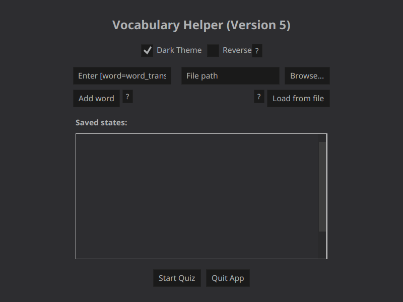
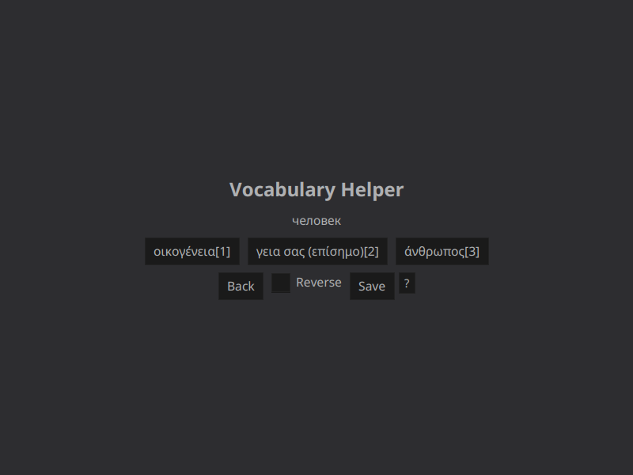
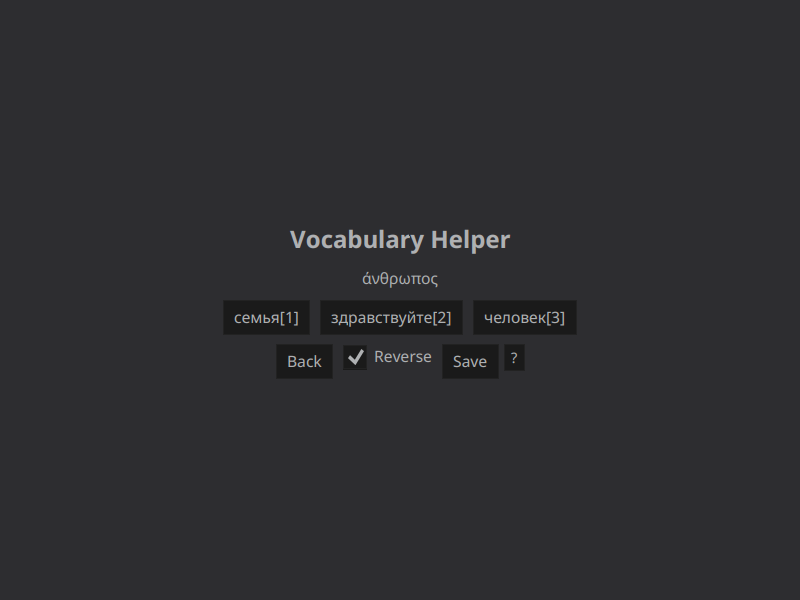

# Vocabulary Helper
This app will help you memorize key-value pairs.

## How to use the app

**Home screen**:

First, launch the app (see above)

When the app is launched, you'll see this screen:


Then you should add at least three pairs.
To do this, simply in the left input type `a = b` or whatever you want for `a`,`b` and then click "Add word".

Do this three times and click 'Start Quiz'.

**ATTENTION**: The equal sign must be between two spaces, otherwise it won't work!

Adding pairs manually in this small input is not ideal, that's why you should use the right part of the app.
You can paste the path to a file in the right input OR click 'Browse...' to select a file that contains pairs like this:
```text
a = b
c = d
d = e
... = ...
```
See examples [here](./dev/test1.txt) or [here](./dev/test2.txt).

Again, the equal sign must be between two spaces.

In the home screen you can also choose 'Dark Theme' if you want or check 'Reverse' if you want the app to ask you in reverse.

**Quiz screen**:

After you click "Start Quiz", you'll see this screen:<br>
(If you don't see this screen, check for any error window).

No Reverse:


Reverse:


In the quit screen, you can click buttons to answer or pres the button 1,2,3 on your keyboard or numpad.
You can enable/disable reverse while the quiz is running using the checkbox.
And, the best feature is that you can save the current quiz state and load it later (you'll see a list in the home screen).
Saving the quiz state is basically the best way to learn because it stores all the data
and the algorithms that count what you learned and what you didn't.

**WARNING: NO DATA IS BEING COLLECTED**

### Secret key events
In the app, there are some secret key events, mostly referring to developers.
- Press `l` in every scene and **logs will be shown**.
- Press `v` in quiz scene and **pairs map will be shown**.

# Thanks to the contributors of this project!
@Krumca97 
@Mancykaur 

## How to build?
To build the project, execute:
```bash
./gradlew build # Linux
.\gradlew.bat build # Windows
```
and to run it:
```bash
./gradlew run # Linux
.\gradlew.bat run # Windows
```

## How to create a release?
I've made some scripts for Windows and Linux that automatically create a zip file that contains:
1. A minimal Java runtime
2. A minimal JavaFX instance
3. The application as jar
4. The required libraries (jars)
5. A run script (.bat or .sh)

To generate this zip, you need a JavaFX instance.
Just download a JavaFX zip for your OS and then execute:
```bash
./make-release.sh /path/to/jfx/instance/root # Linux
.\make-release.bat \path\to\jfx\instance\root # Windows
```
The zip will be generated.

## How to run the app
To run the app:

1. Download `Vocabulary-Quiz-Linux.v3.zip` or `Vocabulary-Quiz-Windows.v3.zip` (based on your operating system).
2. Extract the zip file.
3. Double-click `run.sh` or `run.bat` (based on your os, you'll find one file).

### For advanced users
The release contains a JAR file.
**JAR files are mostly used by advances users**, if you are a beginner, please consider downloading a ZIP file for your OS.
The JAR file is tiny but it requires:

1. JeJFX.jar which you can download [here](https://github.com/iasonasTan/JeJavaFxUtils/releases/tag/v3.0.0).
2. A JavaFX 25 SDK instance which you can download [here](https://www.oracle.com/java/technologies/downloads/javafx/#javafx25).
3. JRE/JVM 25 or newer installed, you can download it [here](https://www.oracle.com/java/technologies/javase/jdk25-archive-downloads.html).

And then you'll have to run the application by running a command like the below:
```bash
java \
	--module-path ".:/path/to/jfx-sdk/instance/" \
	--add-modules JeJFX,JeLib.core,JeLib.io,javafx.base,javafx.graphics,javafx.controls,javafx.fxml \
	-jar Vocabulary-Quiz.v3.jar
```